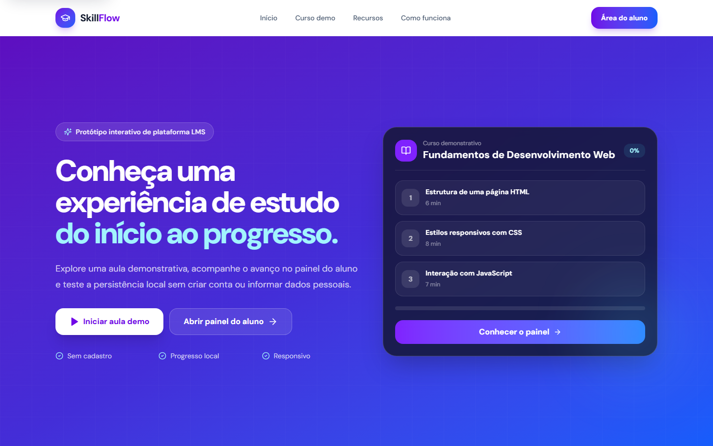
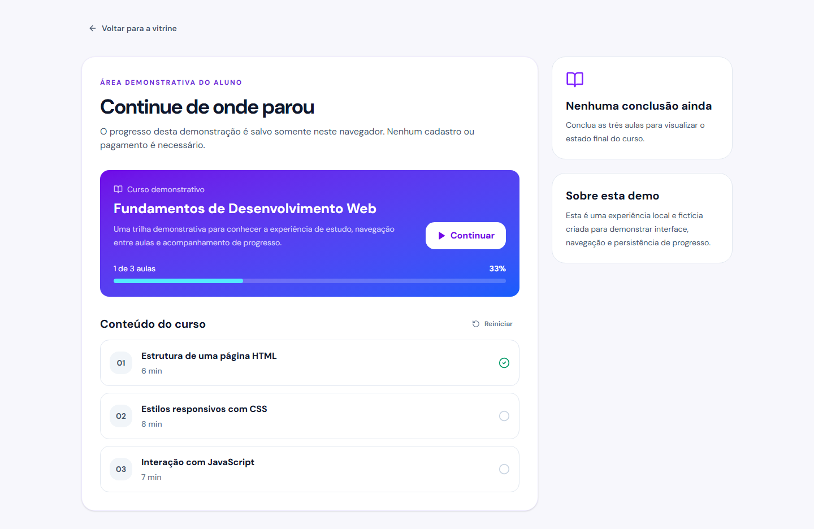
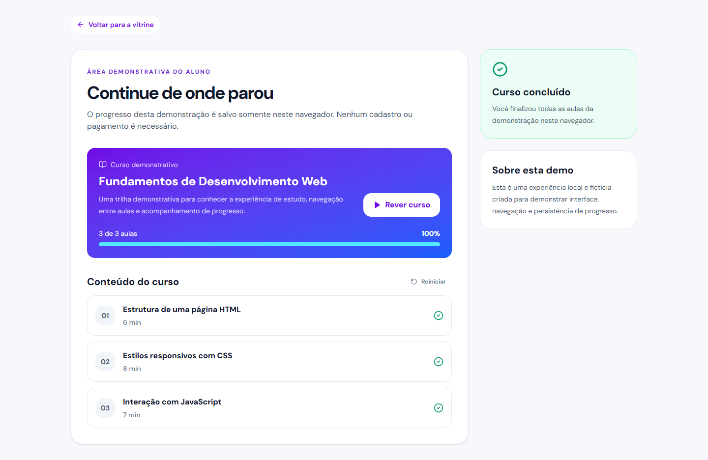

# SkillFlow - Plataforma de Cursos Demo

Protótipo interativo de uma plataforma LMS, criado para demonstrar uma jornada de estudo sem depender de cadastro, pagamentos ou credenciais externas.

- **Aplicação publicada:** https://plataforma-de-cursos-online-tau.vercel.app/
- **Portfólio:** https://lipdev.vercel.app/

> Este repositório é uma demonstração de produto. Cursos, conteúdo e progresso são fictícios e não representam uma operação educacional ativa.

## Visão geral

O projeto permite avaliar um fluxo completo no navegador:

- primeira dobra com posicionamento e CTAs claros;
- curso demonstrativo com três aulas;
- navegação entre aulas;
- marcação de conclusão;
- painel do aluno com estado vazio, andamento e curso concluído;
- progresso salvo em `localStorage`;
- interface responsiva e navegável por teclado.

## Screenshots

### Vitrine



### Painel do aluno



### Estado concluído



## Tecnologias

- React 18
- TypeScript
- Vite 6
- Tailwind CSS 4
- Motion
- Playwright
- ESLint

## Executar localmente

Requisitos: Node.js 20+ e npm.

```bash
git clone https://github.com/LipDev-sudo/Plataforma-de-cursos-online.git
cd Plataforma-de-cursos-online
npm ci
npm run dev
```

A aplicação não exige arquivo `.env` ou serviços externos.

## Verificações

```bash
npm run lint
npm run typecheck
npm test
npm run build
```

Os testes Playwright percorrem a demonstração em 1440×900 e 390×844, verificando progresso local, conclusão, links vazios, foco inicial e overflow horizontal.

## Persistência

O progresso fica apenas no navegador, na chave `skillflow:demo-progress:v1`. O painel permite reiniciar a demonstração. Não há autenticação, banco de dados, upload de vídeos, emissão de certificados ou integração de pagamentos nesta versão.

## Estrutura principal

```text
src/app/
  components/       # vitrine, painel e aula
  data/              # conteúdo demonstrativo tipado
  hooks/             # persistência do progresso local
tests/e2e/           # jornada automatizada desktop e mobile
docs/screenshots/    # capturas reais da aplicação
```

## Autor

Desenvolvido por **Hamilton Felipe Soares da Silva**.

- GitHub: https://github.com/LipDev-sudo
- LinkedIn: https://www.linkedin.com/in/hamilton-felipe-875054383/
- Portfólio: https://lipdev.vercel.app/

## Licença

[MIT](LICENSE)
