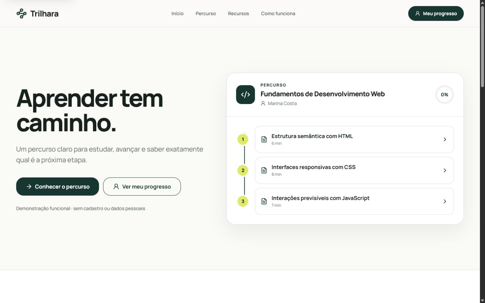
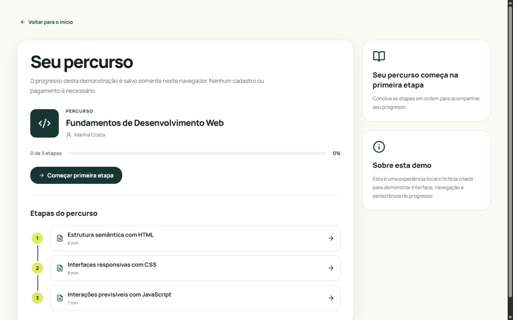
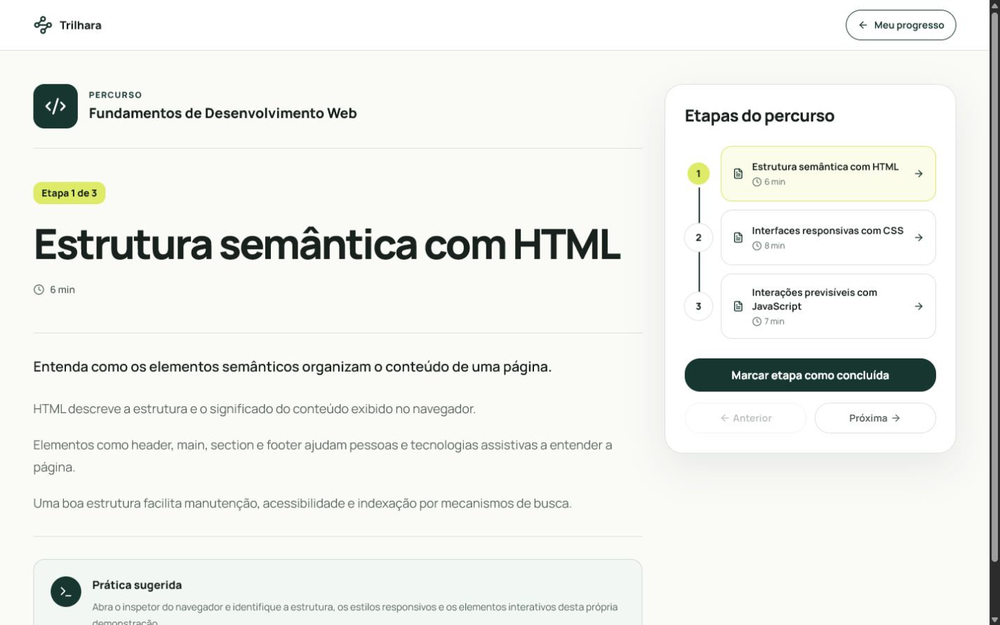
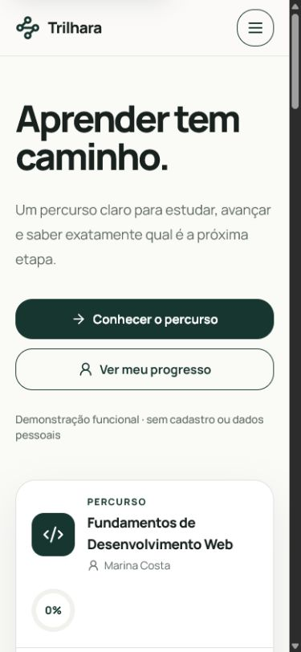

# Trilhara — Aprender tem caminho

Trilhara é uma demonstração funcional de aprendizagem online para escolas digitais, instrutores independentes e empresas que oferecem treinamentos. O produto organiza conteúdos em um percurso claro, mostra a próxima etapa e mantém o progresso no navegador.

- **Demonstração publicada:** https://trilhara.vercel.app/
- **Portfólio:** https://lipdev.vercel.app/

> Este repositório apresenta uma demonstração de produto. Curso, instrutora e progresso são fictícios e não representam uma operação educacional ativa.

## Proposta

O fluxo demonstra uma experiência educacional completa e objetiva:

- percurso **Fundamentos de Desenvolvimento Web** com três etapas coerentes;
- aula com conteúdo, prática sugerida e navegação entre etapas;
- marcação individual de conclusão;
- painel com próxima etapa e progresso total;
- persistência local sem cadastro, credenciais ou serviços externos;
- interface responsiva, contraste AA, foco visível e navegação por teclado.

## Screenshots

### Home — desktop



### Painel de progresso



### Aula



### Home — mobile



## Tecnologias

- React 18
- TypeScript
- Vite 6
- Tailwind CSS 4
- Lucide React
- Playwright
- ESLint

## Executar localmente

Requisitos: Node.js 20+ e npm.

```bash
git clone https://github.com/LipDev-sudo/trilhara.git
cd trilhara
npm ci
npm run dev
```

A aplicação não exige arquivo `.env`, autenticação, banco de dados ou integração externa.

## Validações

```bash
npm run typecheck
npm run lint
npm test
npm run build
npm audit
```

Os testes Playwright percorrem a demonstração em 1440×900 e 390×844. Eles verificam marca e metadados, navegação, progresso persistente, teclado, menu mobile, foco inicial, links inválidos e overflow horizontal.

## Persistência e limitações

O progresso fica somente no navegador, na chave `trilhara:demo-progress:v1`, e pode ser reiniciado pelo painel. Esta demonstração não inclui:

- autenticação ou sincronização entre dispositivos;
- pagamentos;
- upload ou streaming de vídeo;
- certificados;
- painel administrativo;
- outros cursos além do percurso demonstrativo.

## Estrutura principal

```text
src/app/
  components/       # vitrine, painel, aula e percurso
  data/              # conteúdo demonstrativo tipado
  hooks/             # persistência do progresso local
tests/e2e/           # jornada automatizada desktop e mobile
docs/screenshots/    # capturas reais da aplicação
```

## Autor

Desenvolvido por **Hamilton Felipe Soares da Silva**.

- GitHub: https://github.com/LipDev-sudo
- LinkedIn: https://www.linkedin.com/in/hamilton-felipe-875054383/
- Portfólio: https://lipdev.vercel.app/

## Licença

[MIT](LICENSE)
